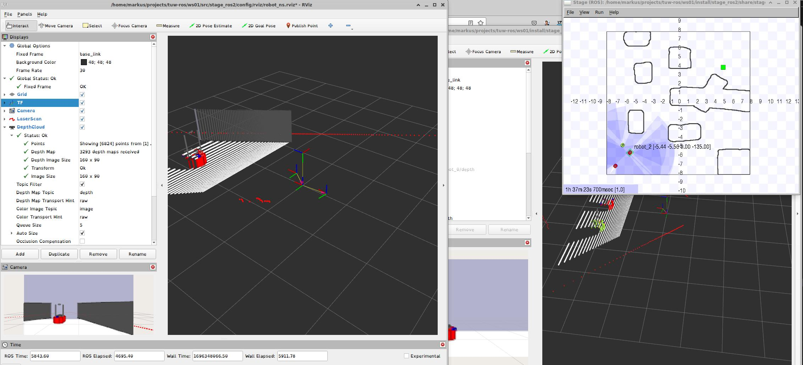

# stage_ros2
Update September 2023: 
 We are supporting now [multiple tf topics](res/multi_robot_setup.md).

* [install](res/install.md)
* [run demos](res/demos.md)
* [handling multiple vehickes](res/multi_robot_setup.md)

 
<table style="width:800px;"><td>
One TF-tree after:  # <b>ros2 launch stage_ros2 demo.launch.py world:=cave_three_robots one_tf_tree:=true</b> 
 on <i>Ubuntu 22.04</i> with ros2 <i>humble</i>
</td></table> 

 
<table style="width:800px;"><td>
Multiple TF-trees after with two rviz nodes for robot_0 and robot_1:  # <b>ros2 launch stage_ros2 stage.launch.py world:=cave_three_robots one_tf_tree:=false</b> 
 # <b>ros2 launch stage_ros2 rviz_ns.launch.py config:=robot_ns namespace:=robot_0</b>
 on <i>Ubuntu 22.04</i> with ros2 <i>humble</i>
</td></table> 

## Thanks
I like to thank all people behind [Stage](https://github.com/rtv/Stage) and [ros-simulation/stage_ros](https://github.com/ros-simulation) for the simulation and the first ROS bridge as well as the people for the initial ROS2 implementations [ShengliangD/stage_ros2](https://github.com/ShengliangD/stage_ros2) and [n0nzzz/stage_ros2](https://github.com/n0nzzz/stage_ros2). The work was used as base for my implementation. Which differs to the previous ROS interfaces in its modularity.