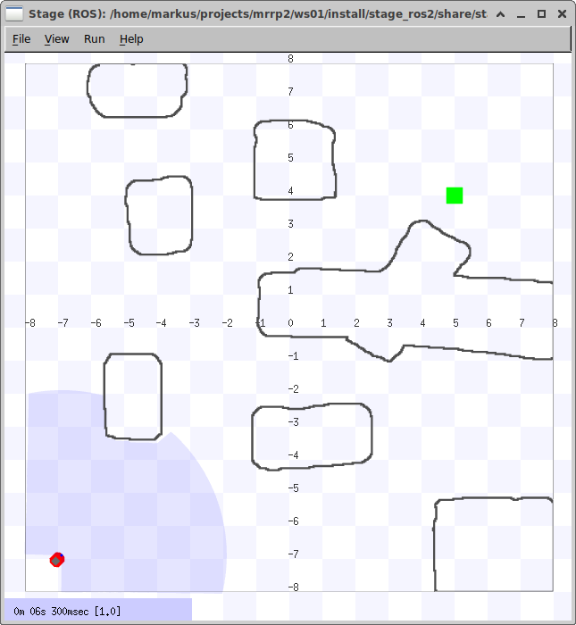
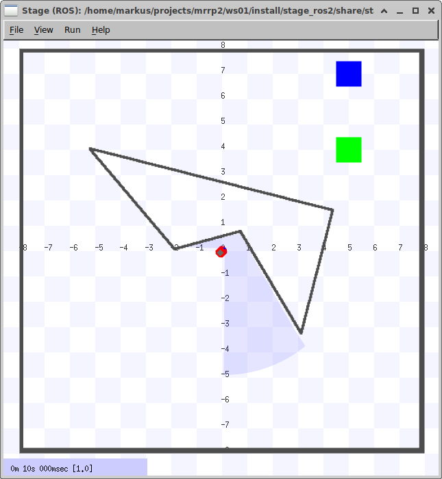
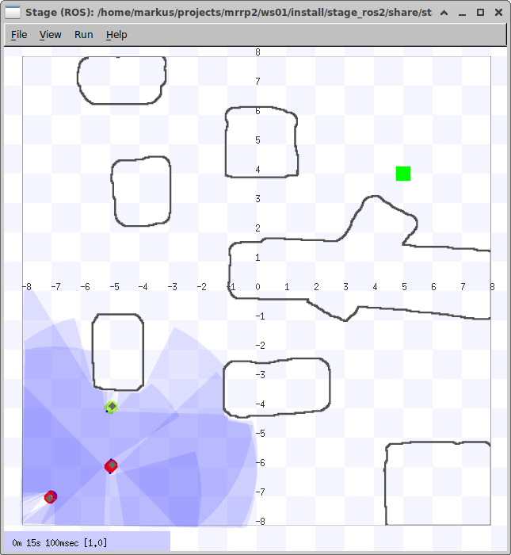
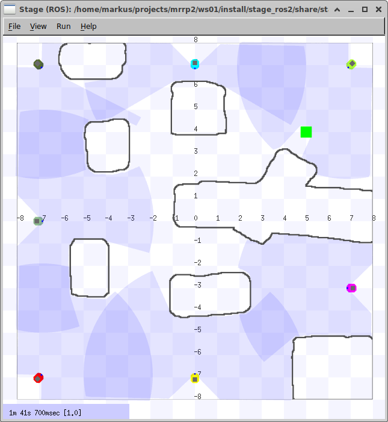

# stage_ros2 Demos

## launch files

### stage
```
## with /tf
ros2 launch stage_ros2 stage.launch.py world:=cave enforce_prefixes:=false one_tf_tree:=true
## with /robot_0/tf
ros2 launch stage_ros2 stage.launch.py world:=cave enforce_prefixes:=true one_tf_tree:=false
```
### stage and rviz
demo worlds with different robot configurations and rviz configs with __one tf tree__
```
ros2 launch stage_ros2 demo.launch.py world:=cave
ros2 launch stage_ros2 demo.launch.py world:=lines
ros2 launch stage_ros2 demo.launch.py world:=cave_three_robots
ros2 launch stage_ros2 demo.launch.py world:=cave_seven_robots
```
<table>
  <tr>
    <th> <br>cave</th>
    <th> <br>lines</th>
    <th> <br>cave_three_robots</th>
    <th> <br>cave_seven_robots</th>
  </tr> 
</table>

### teleop joy

```
ros2 launch stage_ros2 f710.launch.py namespace:='/'       # for a single vehicle world like cave.world
ros2 launch stage_ros2 f710.launch.py namespace:='robot_0' # for a world like cave_multi.world or cave_three_robots.world
```


## parameters on stage_ros2
### without parameters
it will start the cave.world
```
ros2 run stage_ros2 stage_ros2 
```
### with parameters
```
cd stage_ros2/world
ros2 run stage_ros2 stage_ros2  --ros-args --ros-args \
    -p world_file:=lines.world \
    -p use_static_transformations:=true \
    -p enforce_prefixes:=true \
    -p one_tf_tree:=false
```

## SoftReset

```
ros2 service call /reset_positions std_srvs/srv/Empty
```


## tmuxinator
you can use the tmuxinator configurations to start some demos like
```
tmuxinator start -p ./ws01/src/stage_ros2/tmuxinator/cave_three_robots.yml
tmuxinator start -p ./ws01/src/stage_ros2/tmuxinator/cave_one_robot.yml
```