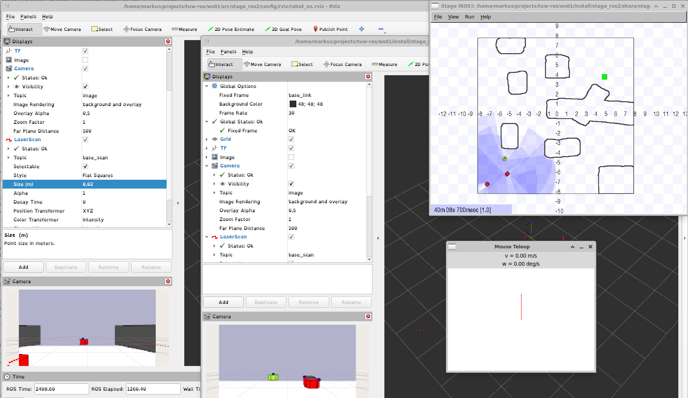
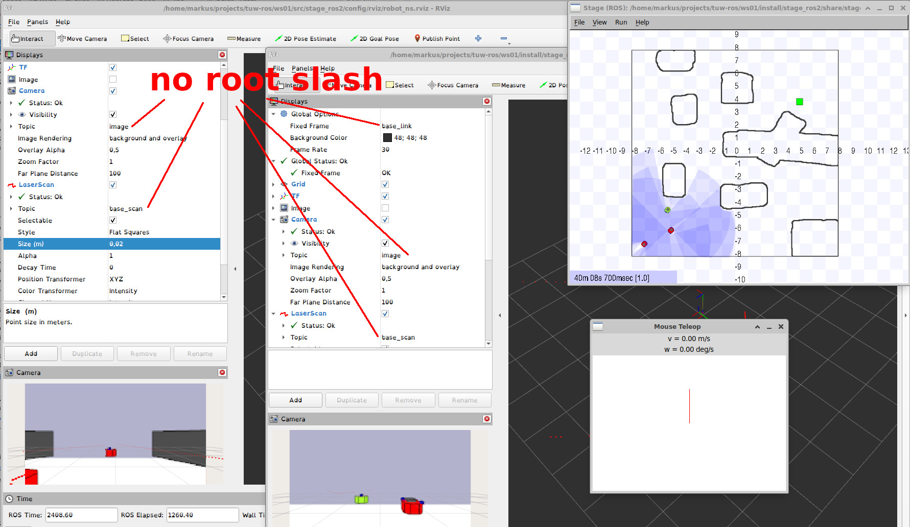

# Multi Robot Setup

Working with multiple vehicles or robots can create a knot in your brain. In order to at least solve my brain knot, I have tried here to document the problem and also possible solutions.

## The Problem

### One Vehicle
Each vehicle needs to be identified in your system. This leads to some sort of naming conventions.  On the other site, one like to use existing software or ROS nodes, but many nodes were designed to work for a single robot systems. For example, you like to use multiple laser scanners, each with a laser filter to cut out scan points. Therefore, you are using a namespace for the published scan like */laser0/scan* and *laser1/scan* and a laser filter within each name space but the TF-tree used for both lasers filters listens to */tf* and not to a namespaces TF-tree. This indicates that a common TF-tree for a vehicle is somehow vital. 

### Multiple Vehicles
Now let's take a look at multiple vehicles.
#### 1. One TF-tree on /tf
In this case, we are using one TF-tree for multiple vehicles, therefore each described frame in the TF-tree needs to be unique in the multi robot system. This leads to fame names with prefixes. 

__For example:__ 
We have a *robot_0/scan* topic publishing a LaserScan message with its data associated to the frame_id  *robot_0/laser* and a second robot with a *robot_1/scan* topic publishing a LaserScan message with its data associated to the frame_id __robot_1/laser_link__.
The associated transforms to the frame_ids __robot_0/laser_link__ and __robot_1/laser_link__ are published on */tf*. 
In this configuration, we can view all localized robots on a common map with their sensor data in RViz. 
On the other site, each robot is listening to all transformations on all robots in the system. Configurations cannot easily be transferred between robots because the used frame_ids with the nodes need to be parametrized with a prefix. Adding a namespace on a node does not add a prefix on the frame_id. 

#### 2. Multiple TF-trees topics (robot_0/tf robot_1/tf)
In this case, we are using for each vehicle a separate TF-tree topic to publish.  Therefore, each described frame in the TF-tree needs to be unique only on this vehicle. This simplifies the parametrization of reused nodes on multiple vehicles. 

__For example:__ 
We still have a namespace such as robot_0 for our laser scan. But the message LaserScan published on *robot_0/scan* topic is associated to the frame_id __laser_link__. A second robot with a *robot_1/scan* topic publishing a LaserScan message with its data also associated to the frame_id __laser_link__. This is possible because the TF-tree used is different for these vehicles, the first one uses the TF-tree published on */robot_0/tf* and the second on */robot_1/tf*. 
In this configuration, we can view only one robot with its sensor data in RViz. 
On the other site, it simplifies the configuration overhead because one just needs to use a namespace on nodes and to remap */tf* to a custom topic with a namespace (*/robot_XXX/tf*).

## Demo
### Demo: one TF-tree on /tf

 
<table style="width:800px;"><td>
One TF-tree after:  # <b>ros2 launch stage_ros2 demo.launch.py world:=cave_three_robots one_tf_tree:=true</b> 
 on <i>Ubuntu 22.04</i> with ros2 <i>humble</i>
</td></table> 

### Demo: multiple TF-trees on /robot_0/tf, /robot_1/tf, /robot_2/tf

 
<table style="width:800px;"><td>
Multiple TF-trees after: 
 # <b>ros2 launch stage_ros2 stage.launch.py world:=cave_three_robots one_tf_tree:=false</b> 
 # <b>ros2 launch stage_ros2 rviz_ns.launch.py config:=robot_ns namespace:=robot_0</b>
 # <b>ros2 launch stage_ros2 rviz_ns.launch.py config:=robot_ns namespace:=robot_1</b>
 # <b>ros2 run mouse_teleop mouse_teleop -r __ns:=/robot_1 --ros-args --remap mouse_vel:=cmd_vel</b>
  on <i>Ubuntu 22.04</i> with ros2 <i>humble</i>
</td></table> 

#### no root slash
It is important to say that there are no root slashes on the subscribed topics in rviz2. Because the rviz config is using a namespace. 

 
<table style="width:800px;"><td>
No root slashes: 
</td></table> 

